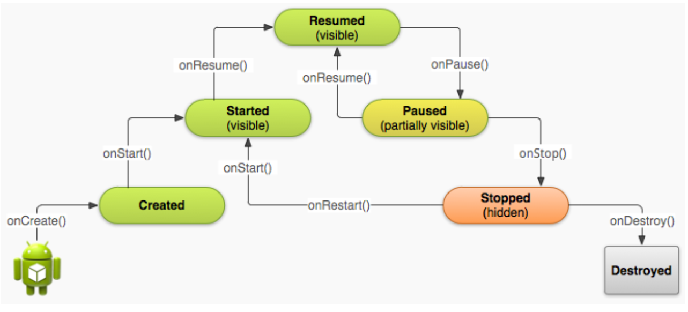

# Vòng đời ứng dụng

## Anatomy 

- Các giai đoạn cơ bản:
    - Created
    - transitioned 
    - destroyed 

- 4 type of core components
    - **activities**: dự báo thời tiết, 
    - **services**: tương tác thông qua thanh trạng thái, không có giao diện, ví dụ: dịch vụ GPS, phát hiện thông tin sóng wifi, phát sóng toạ độ địa lí
    - **broadcast reciver**: lắng nghe tín hiệu và thông báo 
    - **content provider**: hiển thị nội dung ra ngoài, hỗ trợ tương tác với dữ liệu, chỉ dùng co dữ liệu trong ROM, không có tác dụng với thẻ nhớ

## Thành phần
- Một app chạy dưới một máy ảo
- Life và death của một ứng dụng
- Activity stack: `Recent app` và `back`
- Callback: override các phương thức:
```java
    
    void onCreate() // khởi tạo activity
    void onStart() // activity chuẩn bị hiển thị
    void onResume() // activity hiển thị lại, những hoạt động chính của ứng dụng sẽ nằm đây
    void onPause() // avtivity tạm dừng (để thực hiện task khác): thực hiện lưu các thao tác như trạng thái, dữ liệu
    void onStop() // activuty không còn hiển thị, hoàn toàn bị che khuất nhưng vẫn còn lưu thông tin, dọn dẹp vùng nhớ hoặc những gì đã khởi tạo (không dọn dẹp trong onDesrtroy)
    void onDestroy() // activity bị kill
    void onRestart() // 
    
// Phương thức khác giúp lưu dữ liệu
    void onSaveInstanceState()

```



## Bài tập về nhà
The following application demonstrates the transitioning of a simple activity through the
Android’s sequence of Life-Cycle states.
1. A Toast-msg will be displayed showing the current event’s name.
2. An EditText box is provided for the user to indicate a background color.
3. When the activity is paused the selected background color value is saved to a SharedPreferences
container.
4. When the application is re-executed the last choice of background color should be applied.
5. An EXIT button should be provided to terminate the app.
6. You are asked to observe the sequence of messages displayed when the application:
    1. Loads for the first time
    2. Is paused after clicking HOME button
    3. Is re-executed from launch-pad
    4. Is terminated by pressing BACK and its own EXIT button
    5. Re-executed after a background color is setE
7. Thêm các tên thành viên trong nhóm khi nhập màu
8. Lưu lại quá trình khi nhập