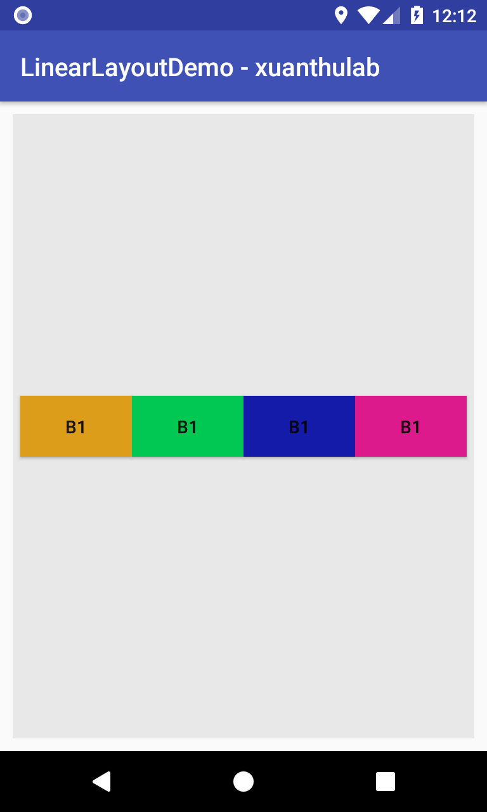
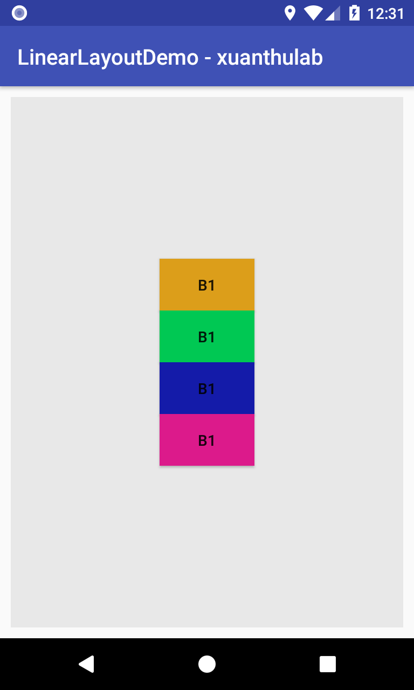
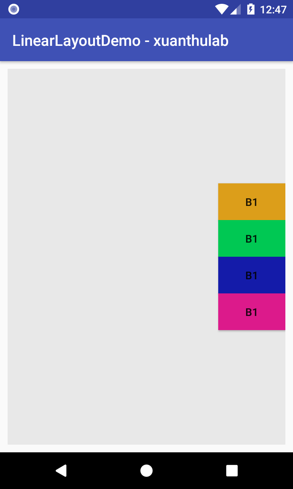

# [MOBILE] Các thẻ (tag) **XML** xuất hiện trong bài tập tuần 1

Các thuộc tính của thẻ phải có `android:` ở trước 🤡

## Các thuộc tính chung
-   `android:padding`: phần đệm của đối tượng
-   `android:margin`: khoảng lề của đối tượng
-   `android:background`: nền của đối tượng
-   ...

## Thẻ `LinearLayout`
Ví dụ:
 ```xml
<LinearLayout xmlns:android="http://schemas.android.com/apk/res/android"
    android:id="@+id/my_linear_layout"
    android:layout_width="match_parent"
    android:layout_height="match_parent"
    android:orientation="vertical" 
    android:padding="2dp" >
</LinearLayout>
 ```

- Phân tích các thuộc tính: (Tham khảo [tại đây](https://xuanthulab.net/su-dung-linearlayout-trong-android.html) và cảu Google ở [đây](https://developer.android.com/guide/topics/ui/declaring-layout?hl=vi#java))
    - `xmlns:android`: Dell cần quan tâm, có sẵn
    - `android:id`: nhận diện duy nhất các layout, cú pháp như mẫu trên ví dụ. 
        - Kí hiệu `@` tại phần đầu của chuỗi chỉ rằng XML Parser nên phân tích cú pháp và mở rộng phần còn lại của chuỗi ID và nhận diện nó như là một ID resource. (Nói ngắn gọn sau `@` là một "kiểu sữ liệu")
        - Biểu tượng `+` nghĩa là một tên resource mới mà phải được tạo và được thêm tới các Resource. (Dễ hiểu hơn, `+` đánh dấu đây là "biến mới" và cần được định nghĩa)
    - `android:layout_width` và `android:layout_height`: chiều cao và chiều rộng của layout
        - `wrap_content` yêu cầu thành phần hiển thị điều chỉnh kích thước theo kích thước cần thiết cho nội dung. 
        - `match_parent` yêu cầu thành phần hiển thị mở rộng bằng với kích thước mà nhóm thành phần hiển thị gốc cho phép.
        - `fill_parent` cho view hiện tại trở nên lớn bằng view cha của nó.
    - `android:orientation`: dùng để thiết lập cách sắp xếp phần tử. Các giá trị có thể nhận: 
        - `horizontal` để sắp xếp theo chiều ngàng
        - `vertical` để sắp xếp theo chiều dọc
    - `android:gravity`: để căn chỉnh các View nằm ở vị trí nào trong LinearLayout. Các tham số có thể nhận (có thể dùng kí hiều `|` để tổ hợp)
        - `center`: Căn giữa
        - `top`: Căn theo cạnh trên
        - `bottom`: Căn theo cạnh dưới
        - `left`: Căn theo cạnh trái
        - `right`: Căn theo cạnh phải
        - `center_horizontal`: Căn giữa theo chiều ngang
        - `center_vertical`: Căn giữa theo chiều dọc
            - Ví dụ (Di chuột vào ảnh để xem thuộc tính):
                - 
                - 
                - 
    - `android:weightSum` và `android:layout_weight`: Giá trị trọng số này sẽ được LinearLayout sử dụng để điều chỉnh kích thước View con có trọng số (điều chỉnh chiều cao nếu là loại LinearLayout đứng và điều chỉnh chiều rộng nếu là loại ngang). (Cái này hiện tại chưa dùng tới, tham khảo thêm [tại đây](https://xuanthulab.net/su-dung-linearlayout-trong-android.html#:~:text=gravity%3D%22right%7Ccenter%22-,Tr%E1%BB%8Dng%20s%E1%BB%91%20weight,-C%C3%A1c%20View%20con))
    

## Thẻ `EditText` và `TextView`
```xml
<EditText android:id="@+id/editText1"
          android:layout_width="match_parent"
          android:layout_height="wrap_content"
          android:hint="Pick background (red, green, blue, white)"
          android:ems="10" >

<TextView android:id="@+id/textView1"
          android:layout_width="wrap_content"
          android:layout_height="wrap_content"
          android:text="spy box - try clicking HOME and BACK" />
```
    