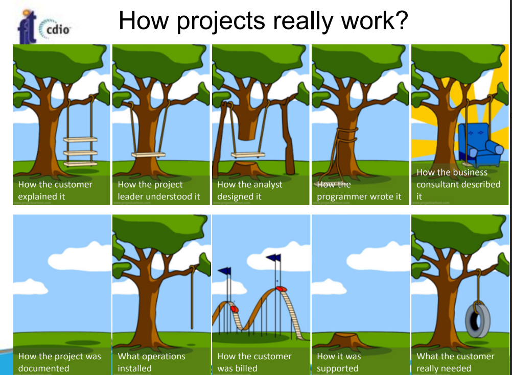

# Tổng quan

## Phần mềm
- Định nghĩa
    - Là khái niệm trừu tượng
    - Gồm các chương trình máy tính và tài liệu liên quan
    - Gắn với hệ thống cụ thể
    - Phát triển trên mục đích cụ thể tuỳ yêu cầu của khách hàng và thị trường
- Vai trò:
    - Chiếm tỉ trọng cao trong các nền kinh tế
- Phân loại phần mềm:
    - Phần mềm dùng chung: mọi người đều có thể mua, miễn có xiền, quyền thay đổi do công ty hoặc nhóm phát triển đặt ra
    - Sản phẩm đặt hàng: phục vụ mục đích cụ thể của khách hàng, quyền thay đổi do khách hàng quyết định.

## Quy trình phần mềm
- Các hoạt động quy trình phần mềm
    - **Đặc tả (Specification)**: mô tả yêu cầu của khách hàng
    - **Phát triển (Development)**: phát triển phần mềm
    - **Thẩm định (Validation)**: kiểm tra phần mềm
    - **Cải tiến (Evolution)**: cải tiến phần mềm, phần mềm đã được đưa vào vận hành và bảo trì
- Những thử thách chính
    - **Tính không đồng nhất**: các ứng dụng yêu cầu đa nền tảng như web, mobile, desktop
    - **Sự thay đổi của xã hội và thương mại**: sự biến đổi của xã hội và thương mại đòi hỏi phần mềm phải thay đổi liên tục
    - **Bảo mật và tin cậy**: vì phần mềm liên quan tới tất cả các mặt của đời sống

## Tính đa dạng của công nghệ phần mềm

- Có nhiều loại hệ thông phần mềm
- Không có một phương pháp nào có thể áp dụng cho tất cả các hệ thống phần mềm
- Sử dụng công cụ và phương pháp phụ thuộc vào
    - Mục đích của hệ thống, yêu cầu KH
    - Kinh nghiệm của nhóm phát triển
    - Công nghệ sử dụng, loại ứng dụng được phát triển
    - Độ phức tạp của hệ thống

### Các loại ứng dụng
- **Ứng dụng độc lập**
    - Chạy trên máy cục bộ như PC
    - Có những tính năng cần thiết
    - Hoạt động offline
- **Ứng dụng dựa vào giao dịch và tương tác**
    - Chạy trên một máy từ xa và được truy cập bởi nhiều người dùng bằng thiết bị của họ
    - VD app thương mại điện tử
- **Ứng dụng điều khiển nhúng**
    - Sử dụng phần mềm điều khiển thiêt bị phần cứng
- **Hệ thống xử lí khối**
    - Xử lí dữ liệu lớn (batch), nhận vào khối dữ liệu lớn đầu vào và đưa ra output tương ứng
- **Hệ thống giải trí**
    - Cung cấp các dịch vụ giải trí cho người dùng
    - VD: game, phim, âm nhạc, ...
- **Hệ thống mô phỏng và mô hình hoá**
    - Mô phỏng các hệ thống thực tế, quy trình vật lí
    - VD: mô phỏng các hệ thống thời tiết, mô phỏng các hệ thống kinh tế, ...
- **Hệ thống thu thập dữ liệu**
    - Thu thập dữ liệu từ nhiều nguồn khác nhau và gửi tới một hệ thống để phân tích dữ liệu đó
    - VD: hệ thống phân tích dữ liệu từ các trang mạng xã hội, hệ thống phân tích dữ liệu từ các trang web, IoT...
- **Hệ thống của hệ thống**
    - Hệ thống phần mềm được sử dụng để phát triển các hệ thống phần mềm khác, chứa một hệ thống phần mềm khác
    - VD: hệ thống phát triển phần mềm, hệ thống quản lí dự án, doanh nghiệp...

### Những nguyên tắc cơ bản
- Sử dụng quy trình dễ hiểu và phù hợp
- Hiệu năng và độ tin cậy của phần mềm là quan trọng hơn các tính năng khác
- Hiểu và quản lý hiệu quả các yêu cầu đặc tả
- Nên sử dụng lại phần mềm có sẵn thay vì viết lại (nếu có thể)

## Công nghệ phần mềm và web
- Web là nền tảng để chạy ứng dụng
- Ngày càng nhiều tổ chức sử dụng ứng dụng web
- Web service cho phép các tính năng của ứng dụng dược truy cập thông qua web 
- Cloud computing (Điện toán đám mây): cung cấp các dịch vụ để chạy trên máy tính từ xa thông qua đám mây
- Tái sử dụng phần mềm là phương pháp phát triển chính để xây dựng những thệ thống dựa trên web 
- Những hệ thống dành cho web được phát triển dần dần
- Là những hệ thống phức tạp
- Những nguyên tắc cơ bản của Công nghệ phần mềm vẫn áp dụng được vào web
- Tuy nhiên giao diện người dùng bị hạn chế bởi trình duyệt
- Các công nghệ phần mềm web
    - HTML, CSS, JavaScript
    - Các framework: React, Angular, Vue, ...
    - Các ngôn ngữ lập trình: Java, C#, Python, ...
    - Các công nghệ backend: NodeJS, ASP.NET, Spring, ...
    - Các công nghệ cơ sở dữ liệu: MySQL, MongoDB, ...
    - Các công nghệ khác: Docker, Kubernetes, ...

## Đạo đức nghề nghiệp
- Các vấn đề đạo đức trong CNPM: 
    - Ngoài kĩ năng ra, còn đòi hỏi trách nhiệm nghề nghiệp
    - Trung thực và có trách nhiệm về đạo đức
    - Không chỉ đơn thuần là tuân thủ pháp luật mà còn liên quan đến các chuẩn mực đạo đức

- Trách nhiệm nghề nghiệp
    - Bảo mật
    - Năng lực
    - Quyền sở hữu trí tuệ
    - Lạm dụng máy tính (??)

- Quy tắc đạo đức ACM/IEEE
    - Được đưa ra bởi hiệp hội chuyên nghiệp ở Mĩ
    - Các thành viên cam kết tuân thủ các nguyên tắc họ đặt ra
    - Có 8 nguyên tắc liên quan đến hành vi và các quyết định của kĩ sư phần mềm chuyên nghiệp:
        - **Công khai - Public**: phải công khai các yếu tố quan trọng của phần mềm
        - **Khách quan - Client and Employer**: phải hành động với sự công bằng và trung thực
        - **Sản phẩm - Product**: phải đảm bảo rằng sản phẩm đáp ứng các tiêu chuẩn chất lượng
        - **Đảm bảo chất lượng - Judgement**: phải đảm bảo rằng các quyết định của mình đều được đưa ra một cách công bằng
        - **Quản lý - Management**: phải quản lý dự án một cách chuyên nghiệp
        - **Chuyên môn - Profession**: phải nỗ lực để nâng cao chuyên môn
        - **Đồng nghiệp - Colleagues**: phải hành động với sự tôn trọng đồng nghiệp
        - **Bản thân - Self**: phải hành động với sự tôn trọng bản thân

    