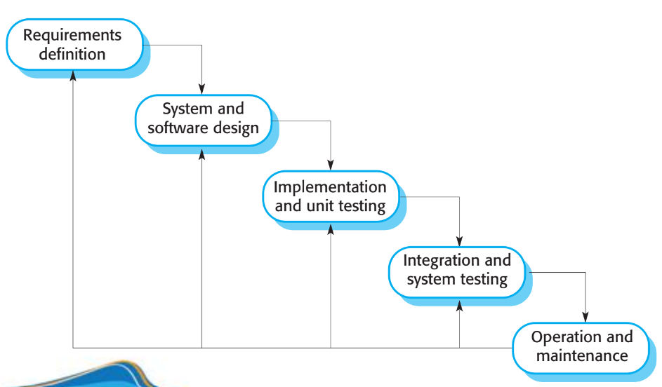

# Quy trình phát triển phần mềm

## Mô hình quy trình phần mềm

- Mọi quy trình phần mềm đều bao gồm những hoạt động:
    - **Đặc tả (Specification)**: mô tả yêu cầu của khách hàng
    - **Thiết kế và phát triển (Design and Development)**: phát triển phần mềm
    - **Kiểm định (Validation)**: kiểm tra hệ thống có thể đáp ứng được nhu cầu người dùng không
    - **Cải tiến (Evolution)**: cải tiến phần mềm, phần mềm đã được đưa vào vận hành và bảo trì
- Mô tả quy trình phần mềm:
    - Các hoạt động trong quy trình
    - Thứ tự các hoạt động
    - Các mô tả bao gồm:
        - **Sản phẩm (Product)**: kết quả đầu ra của sản phẩm
        - **Vai trò (Role)**: Phản ánh trách nhiệm của người tham gia
        - **Điều kiện trước và điều kiện sau (Pre- and Post-conditions)**: Điều kiện trước và sau khi hoạt động được thực hiện
- Các loại qui trình:
    - Quy trình hoạch định sẵn (Plan-driven process) là quy trình được hoạch định trước và tiến độ đánh giá dựa trên các hoạt động được thực hiện
    - Quy trình linh hoạt (Agile process) là quy trình được thực hiện dần dần và dễ dàng thay đổi dựa trên yêu cầu của khách hàng
    - Hầu hết các quy trình phần mềm đều là sự kết hợp của cả hai loại quy trình trên
    - Không có quy trình nào đúng hay sai

- Các mô hình quy trình phần mềm: 
    - **Mô hình phát triển phần mềm tuần tự (Waterfall model)**: 
        - Mô hình phát triển phần mềm tuần tự là mô hình phát triển phần mềm theo hướng tuần tự, các hoạt động được thực hiện tuần tự từ đầu đến cuối
        - Ưu điểm:
            - Dễ hiểu và dễ triển khai
            - Dễ quản lí tiến độ
            - Dễ đánh giá kết quả
        - Nhược điểm:
            - Không phù hợp với các hệ thống lớn
            - Không phù hợp với các hệ thống có tính tương tác cao
            - Không phù hợp với các hệ thống có tính thay đổi cao
    
    - **Mô hình phát triển phần mềm tiến hóa (Evolutionary development model)**: 
        - Mô hình phát triển phần mềm tiến hóa là mô hình phát triển phần mềm theo hướng tiến hóa, các hoạt động được thực hiện tuần tự từ đầu đến cuối nhưng có thể thay đổi theo yêu cầu của khách hàng. Các hoạt động được thực hiện đan xen nhau. Lấy phản hồi nhanh từ khách hàng
        - Ưu điểm:
            - Dễ hiểu và dễ triển khai
            - Dễ quản lí tiến độ
            - Dễ đánh giá kết quả
            - Phù hợp với các hệ thống có tính tương tác cao
            - Giảm được chi phí khi đáp ứng yêu cầu
            - Phù hợp với các hệ thống có tính thay đổi cao
        - Nhược điểm:
            - Quy trình không rõ ràng
            - Cấu trúc giảm đi vì phần mới được thêm vào
            - Không phù hợp với các hệ thống lớn
        
    - **Mô hình phát triển phần mềm theo hướng tái sử dụng (Reuse-oriented development model)**: 
        - Mô hình phát triển phần mềm theo hướng tái sử dụng là mô hình phát triển phần mềm theo hướng tái sử dụng các thành phần đã được phát triển trước đó
        - Ưu điểm:
            - Dễ hiểu và dễ triển khai
            - Dễ quản lí tiến độ
            - Dễ đánh giá kết quả
            - Phù hợp với các hệ thống có tính tương tác cao
            - Phù hợp với các hệ thống có tính thay đổi cao
            - Phù hợp với các hệ thống lớn
        - Nhược điểm:
            - Không phù hợp với các hệ thống có tính tương tác cao
            - Không phù hợp với các hệ thống có tính thay đổi cao
        
    - Thực tế các mô hình phát triển phần mềm thường là **sự kết hợp của các mô hình trên**

