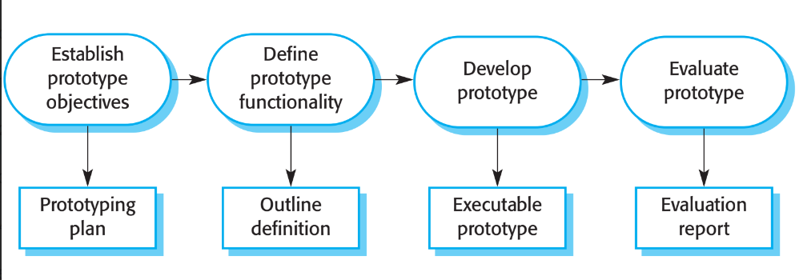
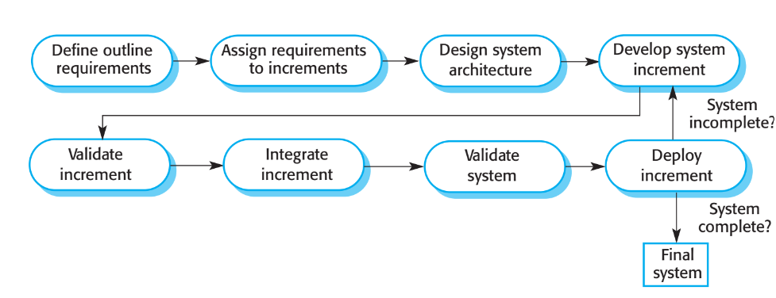

# Quy trình phần mềm (tiếp theo)

## Thích nghi với sự thay đổi

- Thay đổi là điều hiển nhiên
- Thay đổi dẫn đến việc làm lại (tốn thêm chi phí)

## Giảm thiểu chi phí làm lại
 - Tránh thay đổi (Change avoidance)
    - Trong quy trình chứa các hoạt động đoán trước những thay đổi có thể xảy ra

 - Chấp nhận thay đổi (Change acceptance)
    - Quy trình được thiết kế để chấp nhận thay đổi với chi phí thấp
    - Thường sử dụng mô hình phân phối dần dần (Envolving distribution model)

## Nguyên bản phần mềm (Software prototype)
- Nguyên bản (prototype) là phiên bản đầu tiên của hệ thống, dùng để demo và thử nghiệm các tuỳ chọn thiết kế, tìm giải pháp cho một vấn đề

- Nguyên bản có thể được sử dụng cho các trương hợp:
    - Giúp cho quá trình thu thập và xử lí yêu cầu
    - Tìm ra giải pháp và phát triển thiết kế giao diện người dùng
    - Trong quy trình kiểm thử để chạy các kiểm thử back-to-back

### Lợi ích của nguyên bản phần mềm
- Cải thiện khả năng sử dụng hệ thống.
- Thoả mãn tốt hơn nhu cầu thực của người dùng.
- Cải thiện chất lượng thiết kế.
- Cải thiện khả năng bảo trì hệ thống.
- Giảm bớt nỗ lực phát triển.

### Phát triển nguyên bản

-  Có thể dựa vào các công cụ và ngôn ngữ để phát triển nguyên bản.
-  Có thể loại bỏ một số tính năng
    - Nguyên bản nên tập trung vào những tính năng chưa  được hiểu rõ ràng;
    - Kiểm tra lỗi không nằm trong nguyên bản;
    - Tập trung vào các yêu cầu chức năng hơn là các yêu cầu phi chức năng.

### Sử dụng nguyên bản
- Nguyên bản không phải là cái cơ bản để phát triển hệ thống &rarr; cần được loại bỏ. Do:
    -  Khó có thể điều chỉnh hệ thống để đáp ứng được các yêu cầu phi chức năng;
    -  Nguyên bản thường không được viết tài liệu;
    -  Cấu trúc nguyên bản thường bị phá vỡ do bị thay đổi nhanh;
    -  Nguyên bản có thể không đáp ứng được những tiêu
chuẩn chất lượng về mặt tổ chức.

## Chuyển giao dần dần

### Ưu điểm
- Khách hàng sớm được bàn giao sản phẩm (từng phần).
- Các phần đầu được xem như một nguyên bản để hỗ trợ cho việc xác định yêu cầu cho phần sau.
- Nguy cơ thất bại toàn hệ thống thấp.
- Duy trì được ưu điểm của phát triển từng phần &rarr; dễ thích nghi với sự thay đổi của hệ thống.
- Những dịch vụ hệ thống có độ ưu tiên cao nhất sẽ được kiểm thử nhiều nhất

## Mô hình xoắn ốc Boehm (Boehm's spiral model)

- Mỗi sector bao gồm:
    - Xác định mục tiêu
    - Đánh giá các rủi ro
    - Phát triển và kiểm thử
    - Phân tích và kế hoạch

## Quy trình RUP (Rational Unified Process)

- Gồm 4 pha:
    - **Khởi đầu (Inception)**: xác định phạm vi và mục tiêu của dự án
    - **Lập kế hoạch (Elaboration)**: xác định các yêu cầu chức năng và phi chức năng
    - **Xây dựng (Construction)**: phát triển hệ thống
    - **Triển khai (Transition)**: triển khai hệ thống

