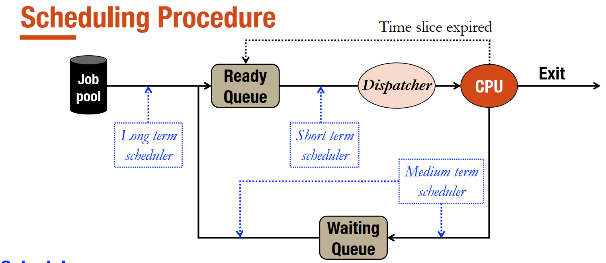

# Lập lịch CPU
## Chu kì CPU và chu kì nhập xuất
- Một tiến trình bao gồm 2 quá trình cơ bản là nhập xuất và xử lí

- Thử tục điều phối
    

- Bộ định thời là một phần của hệ điều hành, quản lí việc chuyển đổi giữa các tiến trình:
    - Bộ định thời dài hạn: đẩy các tiến trình vào hàng đợi để thực thi
    - Bộ định thời ngắn hạn: lựa chọn tiến trình nào được thực thi
    - Bộ định thời trung gian: lựa chọn tiến trình nào được thực thi khi có nhiều tiến trình cùng chờ tài nguyên

- Bộ điều phối (Dispatcher): thực hiện việc chuyển đổi ngữ cảnh, chuyển tiến trình từ trạng thái chờ sang trạng thái sẵn sàng và lưu lại trạng thái của tiến trình đang được thực thi để chuyển sang tiến trình khác.

- Mỗi quá trình sẽ liên quan tới một trạng thái của tiến trình.

### Tiêu chí điều phối
- Công bằng và hiệu quá
- Tối đa hóa sử dụng CPU
- Cực đại hoá thông lượng
- Tối thiểu hóa thời gian đáp ứng, thời gian chờ đợi, thời gian lưu lại hệ thống   
****Các tiêu chí trên là không đồng thời thoả mãn*

### Các loại điều phối
    - Điều phối độc quyền
    - Điều phối không độc quyền

