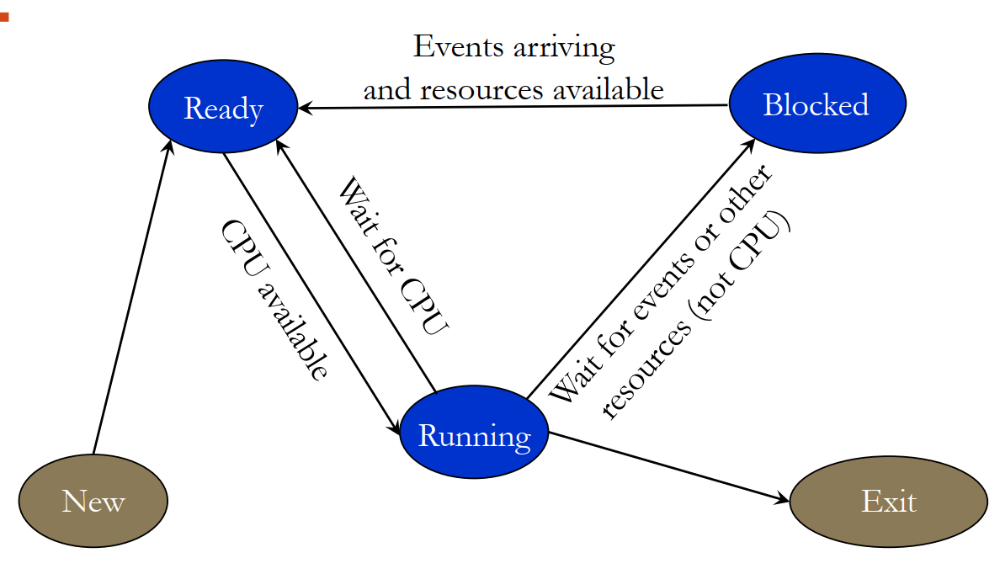
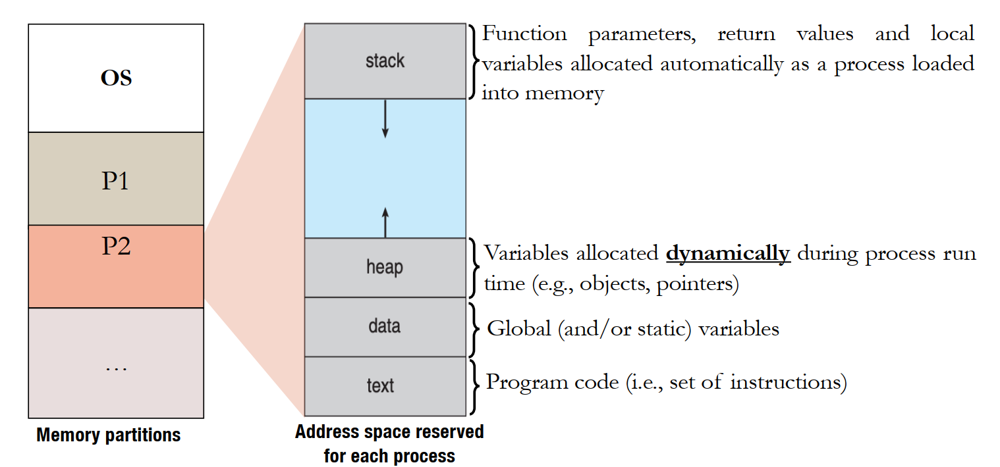
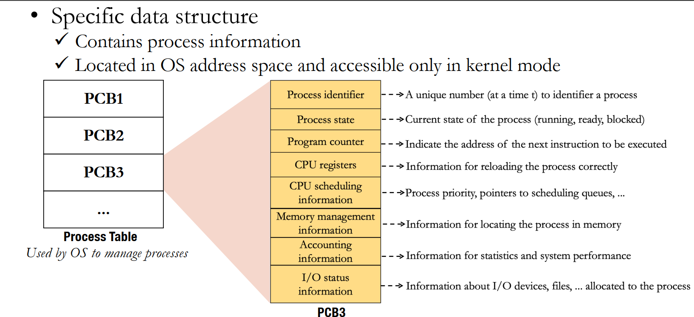
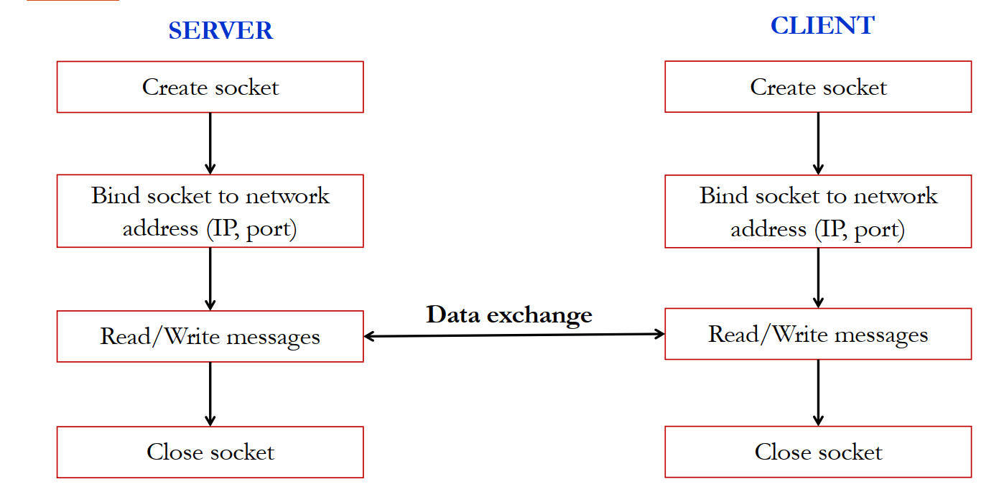
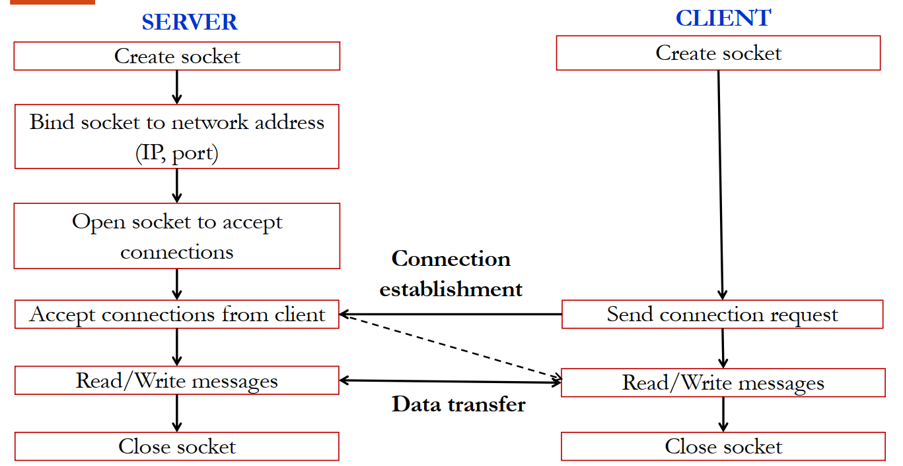

# Tiến trình và cơ chế liên lạc liên tiến trình

## Khái niệm tiến trình
- Chương trình: mã lệnh được viết bằng các ngôn ngữ lặp trình &rarr; biên dịch &rarr; Object code &rarr; liên kế với các thư viện &rarr; Mã lệnh có thể thực thi (Đối tượng tĩnh)
- Tiến trình:  Mã lệnh có thể thực thi &rarr; Tải vào bộ nhớ &rarr; hình ảnh trừu tượng của chương trình: Nằm trong hàng đợi của hdh và chờ CPU thực thi (đối tượng động), động hoá các thực thi. Tốn tài nguyên

## Tính năng tiến trình

### Trạng thái của tiến trình
- 3 trạng thái chính và 2 trạng thái phụ
    - **New** (phụ): tạo lập, cấp phát tài nguyên cho tiến trình
    - **Ready** (chính): khi nằm trong hoàng đợi của hệ thống chờ thực thi
    - **Running** (chính): đang được chạy
    - **Blocked** (chính): khi không đủ tài nguyên để chạy, tiến trình sẽ bị đưa vào hàng đợi của tài nguyên đang chờ. Sau khi `Blocked` phải quay lại `Ready` để chờ hệ điều hành điều phối. Tt ko có quyền trực tiếp quay lại running
    - **Exit** (phụ): (hoặc **Terminate**) Hdh thu hồi tài nguyên và giải phóng các tài nguyên liên quan.

    

### Không gian địa chỉ của tiến trình
- Trong bộ nhớ của luôn có một phần dành cho hệ điều hành
- Khi kích hoạt một system call, trạng thái đc chuyển qua kernel mode
- Mỗi tiến trình sẽ có một không gian ô nhớ dành cho nó

    

- Đoạn mã nhị phân của chương trình nằm ở `text`, các phần còn lại nằm ở các phần khác
- Không gian của `stack`: tham số hàm, giá trị trả về, biến cục bộ... các biến số được khai báo tĩnh, cấp phát tự động
- Không gian của `heap`: hệ điều hành cấp phát khi chạy, được người dùng yêu cầu cấp phát, được thu hồi và giải phóng với lập trình viên hoặc bộ dọn rác
- Không gian của `data`: Chứa các biến được khai báo static hoặc global

### Khối quản lí tiến trình (PCB - Process Control Block)

- `Process ID`: để định danh tiến trình đó, là duy nhất trong một thời điểm
- `Process state`: Trạng thái tiến trình
- `Program counter`: địa chỉ lệnh tiếp theo của tiến trình
- `CPU register`: tải chính xác các tiến trình 
- `CPU scheduling info`:  thông tin cần thiết cho việc lựa chọn tiến trình được thực thi
- `Memory`:
- `Accounting information`: thông tin hiệu suất, tài nguyên
- `I/O information`: liên quan tới nhập xuất

### Chuyển đổi ngữ cảnh
- là quá trình lưu lại PCB của tt đang được thực thi và lưu lại trong bộ nhớ và hđh thực thi tt khác

## Thao tác trên các tiến trình
### Khởi tạo tiến trình
- Tiến trình cha có thể sẽ tạo ra các tiến trình con
- Tiến trình con có thể là bản sao của tiến trình cha, chạy cùng tập lệnh hoặc thực hiện đoạn mã lệnh khác
- Khi một tiến trình mới được tạo lập, hdh sẽ cấp cho 1 mã định danh và 1 PCB

- Cây tiến trình: được tạo lập theo thứ tự khởi tạo

- Kết thúc tiến trình: khi hoàn thành hoặc nắt tiến trình bới tiến trình cha

- Tiến trình 'Zombie': tiến trình con kết thúc nhưng pcb vẫn còn nằm trong vùng nhớ của hệ điều hành do tt cha ko nhận được tín hiệu hoàn thành của tt con

- Tiến trình mồ côi: khi tiến trình cha kết thúc
    - TH1: tiến trình con cũng buộc phải kết thúc
    - TH2: tiến chình con vẫn tồn tại cho tới khi tt con được giao lên cấp cao nhất

## Cơ chế liên lạc giữa các tiến trình
- **Pipe**: truyền dữ liệu theo một chiều 
    - Bao gồm reader và writer 
    - Pipe liên lạc không định danh (Ordinary pipes) được sử dụng khi các tiến trình liên lạc theo quan hệ cha con còn liên lạc với tiến trình ngoài thì cần phải định danh (Named pipes)
- **Vùng nhớ chia sẻ (Shared Memory)**: 
    - Các tt liên lạc thông qua việc dùng chung 1 vùng nhớ, các tt này cần phải có một thuật toán, cơ chế đồng bộ hoá với các tiến trình khác nhằm đảm bảo vùng nhớ chia sẻ được sử dụng tối ưu
- **Socket**:
    - Cơ chế liên lạc trên nhiều máy khác nhau
    - Một socket được định dang bằng *địa chỉ IP* và *port*
    - Hoạt động theo mô hình Client-server
    - Có 2 loại socket:
        - `UDP`: Thông điệp không yêu cầu xác minh kết nối, còn nhận được hay không thì không quan tâm, nếu bị mất thì không có cơ chế xử lí

        

        - `TCP`: Khi gửi cần phải xác minh kết nối, đảm bảo nhận được hơn và có cơ chế xử lí khi mất thông điệp.

        
