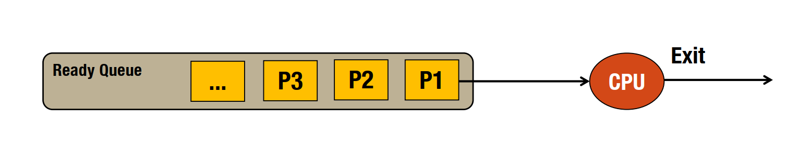
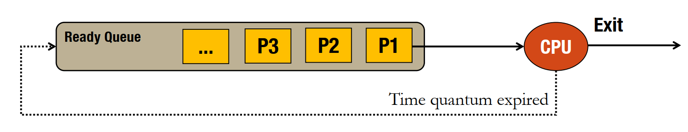
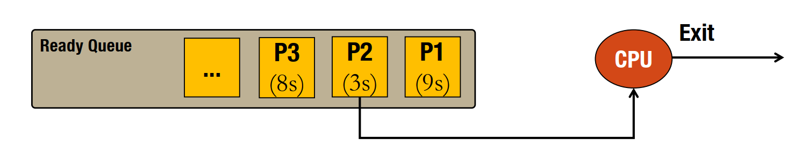
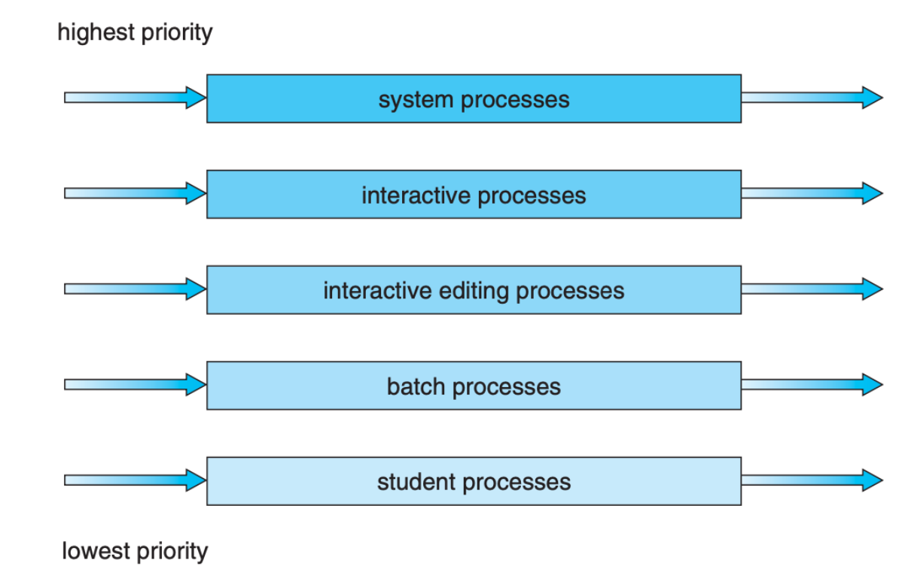

# Điều phối CPU (tiếp theo)

## Thuật toán định thời

### Thuật toán FCFS (First Come First Serve)
- Thuộc nhóm điều phối độc quyền (non-preemptive)
- Tiến trình nào đến trước thì được thực thi trước
- Đơn giản, chỉ cần 1 hàng đợi ready queue  
- Không ưu tiên
- Hiệu năng thấp
- Trường hợp bị block, tiến trình sau có thể được thực thi 

    

Vd:

| Process | Arrival Time | Burst Time | Turnaround Time | Waiting Time |
|---------|--------------|------------|-----------------|--------------|
| P1  | 0 | 24  | 24   | 0   |
| P2  | 1 | 5   | 29   | 23  |
| P3  | 2 | 3   | 31   | 27  |

Turnaround time = Thời gian hoàn thành - Thời gian đến
Waiting time = Thời gian chờ đợi = Thời gian hoàn thành - Thời gian đến  - Thời gian thực thi

### Thuật toán RR (Round Robin)
- Thuộc nhóm điều phối không độc quyền (preemptive)
- Tiến trình được thực thi trong một khoảng thời gian nhất định (time quantum)
- Nếu tiến trình không hoàn thành trong khoảng thời gian đó thì bị ngắt và đưa vào cuối hàng đợi

    

Vd: với q = 4
| Process | Arrival Time | Burst Time | Turnaround Time | Waiting Time |
|---------|--------------|------------|-----------------|--------------|
| P1  | 0 | 24  | 32   | 8   |
| P2  | 1 | 5   | 15   | 10  |
| P3  | 2 | 3   | 9    | 6   |

### Thuật toán SJF (Shortest Job First) và SRTF (Shortest Remaining Time First)
- `SJF`: Thuộc nhóm điều phối độc quyền (non-preemptive)
- `SJF`: Nếu có tiến trình mới có thời gian thực thi ngắn hơn thì tiến trình đang thực thi sẽ không bị ngắt (Chung thuỷ)
- `SJF`: Có thể dẫn đến hiện tượng đói (starvation)
- `SRTF`: Thuộc nhóm điều phối không độc quyền (preemptive)
- Tiến trình có thời gian thực thi ngắn nhất được thực thi trước
- `SRTF`: Nếu có tiến trình mới có thời gian thực thi ngắn hơn thì tiến trình đang thực thi sẽ bị ngắt để thực thi tiến trình mới (Có mới nói cũ)

    

Ví dụ: SRFT
| Process | Arrival Time | Burst Time | Turnaround Time | Waiting Time |
|---------|--------------|------------|-----------------|--------------|
| P1  | 0 | 24  | 32   | 8   |
| P2  | 1 | 5   | 8    | 3   |
| P3  | 2 | 3   | 3    | 0   |

### Thuật toán Priority
- Thuộc nhóm điều phối không độc quyền (preemptive)
- Tiến trình có độ ưu tiên cao nhất được thực thi trước
- Nếu có tiến trình mới có độ ưu tiên cao hơn thì tiến trình đang thực thi sẽ bị ngắt để thực thi tiến trình mới
- Có thể dẫn đến hiện tượng đói (starvation) &rarr; giải pháp `Aging`: độ ưu tiên động (độ ưu tiên tăng dần theo thời gian chờ đợi)

Ví dụ:
| Process | Arrival Time | Burst Time | Priority | Turnaround Time | Waiting Time |
|---------|--------------|------------|----------|-----------------|--------------|
| P1  | 0 | 24  | 3    | 32   | 8   |
| P2  | 1 | 5   | 2    | 8    | 3   |
| P3  | 2 | 3   | 1    | 3    | 0   |

### Thuật toán Multilevel Priority Queue
- Thuộc nhóm điều phối không độc quyền (preemptive)
- Tiến trình được phân vào các hàng đợi ưu tiên khác nhau
- Mỗi hàng đợi có một thuật toán điều phối khác nhau

    

### Một số thuật toán khác
- Lottery Scheduling
- Fair Share Scheduling
        

## Một số bài tập
- [Đề](w3doc/BTLT2_CPU_Scheduling.pdf) và [bài giải](w3doc/bt.xlsx) 