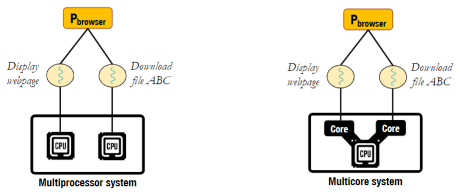
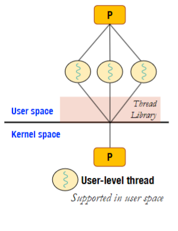
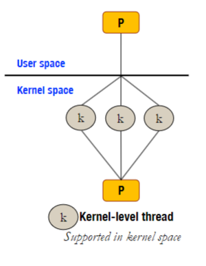
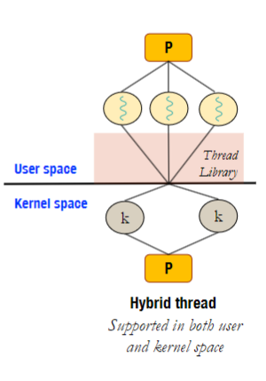
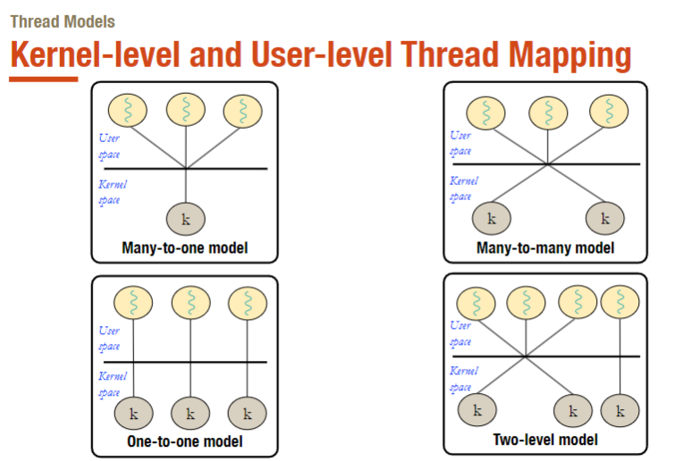
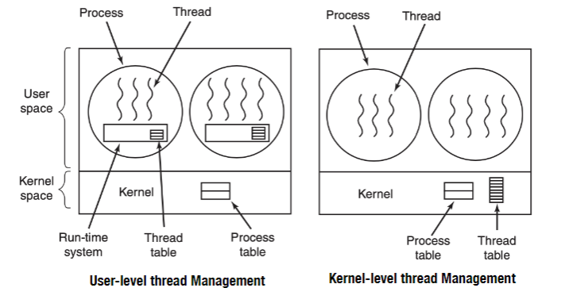
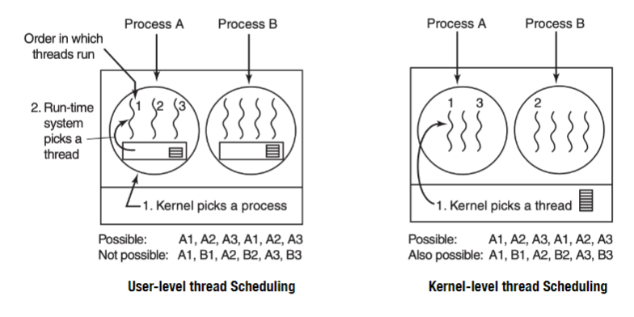

# Thread (Luồng - Tiểu trình)

## Concepts (Khái niệm)
- Tiểu trình là một luồng thực thi của một tiến trình

- Single-threaded process (Tiến trình đơn luồng): Một tiến trình chỉ có một luồng thực thi
- Multi-threaded process (Tiến trình đa luồng): Một tiến trình có nhiều luồng thực thi, mỗi luồng có một địa chỉ stack riêng, nhưng chia sẻ cùng một bộ nhớ, tài nguyên, file mở, ... với các luồng khác trong tiến trình đó. Đa số các hệ điều hành hiện đại đều hỗ trợ tiến trình đa luồng.

- Các tiểu trình con phải sở hữu 1 register (con trỏ lệnh) riêng và 1 stack riêng

- Tiến trình thực hiện nhiều công việc cùng lúc, mỗi công việc được thực hiện bởi một tiểu trình riêng

    

- Lợi ích khi sử dụng tiểu trình
    - Phản hồi nhanh: Khi một tiểu trình bị block thì tiến trình vẫn có thể thực hiện các công việc khác
    - Chia sẻ tài nguyên: Các tiểu trình trong cùng một tiến trình có thể chia sẻ tài nguyên với nhau
    - Giảm chi phí: kinh phí tạo tiểu trình sẽ ít hơn so với tạo tiến trình
    - Khả năng mở rộng: Các tiểu trình có thể thực thi trên các core/processor khác nhau

## Models (Mô hình)

### TIểu trình mức người dùng (User-level threads)
- Các tiểu trình được quản lý bởi ứng dụng, không được hệ điều hành biết đến. Do người dùng tạo ra dưới dự hỗ trợ của ngôn ngữ lập trình hoặc thư viện

    

- Ưu điểm:
    - Được tạo ra bới người dùng và thư viện (như APId hỗ trợ bởi ngôn ngữ lập trình) trong không gian người dùng và không cần sự can thiệp của hệ điều hành
    - Be efficent (Hiệu quả): Các thao tác tạo, chuyển đổi, chấm dứt tiểu trình được thực hiện bởi thư viện, không cần sự can thiệp của hệ điều hành
    - Không cần sự hỗ trợ từ hệ điều hành

- Nhược điểm:
    - Hệ điều hành không biết về các iểu trình người dùng
    - Khi một tiểu trình bị block thì toàn bộ tiến trình cũng bị block

### Tiểu trình mức hệ điều hành (Kernel-level threads)
- Các tiểu trình được quản lý bởi hệ điều hành, được tạo ra bằng các hàm hệ thống. Các tiểu trình được hệ điều hành ngầm định tạo ra khi một tiến trình được tạo ra. Được thực thi trong không gian hạt nhân (kernel space)

    

- Ưu điểm:
    - Hệ điều hành biết về các tiểu trình và quản lí chúng
    - Khi một tiểu trình bị block thì các tiểu trình khác vẫn có thể thực thi
    - Có thể thực thi trên nhiều core/processor khác nhau
- Nhược điểm:
    - Cần sự hỗ trợ từ hệ điều hành
    - Cần nhiều tài nguyên hơn so với tiểu trình mức người dùng dẫn tới hiệu năng thấp hơn và chậm hơn

### Mô hình lai (Hybrid model)
- Kết hợp cả hai mô hình trên. Một tiến trình có thể có nhiều tiểu trình mức người dùng, sau đó hệ điều hành sẽ tạo ra các tiểu trình mức hệ điều hành.

    

- Các phương thức ánh xạ tiểu trình mức người dùng sang tiểu trình mức hệ điều hành:

    

    - Many-to-one (Nhiều tiểu trình mức người dùng ánh xạ sang một tiểu trình mức hệ điều hành)
    - One-to-one (Một tiểu trình mức người dùng ánh xạ sang một tiểu trình mức hệ điều hành)
    - Many-to-many (Nhiều tiểu trình mức người dùng ánh xạ sang nhiều tiểu trình mức hệ điều hành)
    - Two-level (Hai cấp độ): Phối hợp giữa one-to-one và many-to-many

## Thread management (Quản lý luồng)
### User-level vs Kernel-level thread management

- Thread table của tiểu trình đa luồng (multi-threaded process) chứa thông tin về các tiểu trình trong tiến trình đó. Các thông tin này bao gồm: ID, register, stack, trạng thái, ...
- Ở User-level thread management, thread table được quản lý bởi thư viện, không cần sự can thiệp của hệ điều hành. Các thao tác tạo, chuyển đổi, chấm dứt tiểu trình được thực hiện bởi thư viện và người dùng.
- Ở Kernel-level thread management, thread table được quản lý bởi hệ điều hành. Các thao tác tạo, chuyển đổi, chấm dứt tiểu trình được thực hiện bởi hệ điều hành.

### Lập lịch tiểu trình (Thread scheduling)

