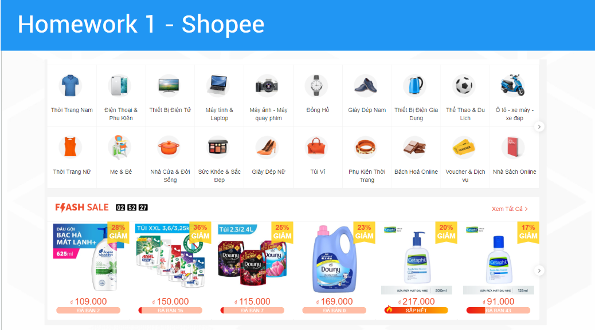
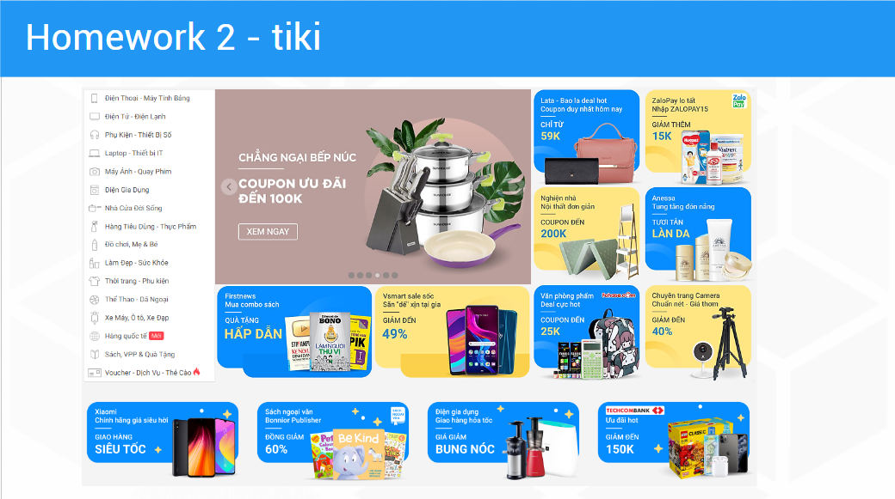

# Các loại Layout

## Canvas
- Các widget được đặt tuyệt đối theo tọa độ x, y
- `Canvas.ZIndex` để đặt thứ tự vẽ các widget, giá trị càng lớn thì widget càng nằm trên

## StackPanel
- Các widget được đặt theo chiều dọc hoặc chiều ngang (Như linear layout trong Android)
- Các widget được đặt tương đối với nhau hoặc với parent
- `Orientation` để thiết lập chiều dọc hoặc chiều ngang hoặc chiều dọc
    - `Horizontal`: các widget được đặt theo chiều ngang
    - `Vertical`: các widget được đặt theo chiều dọc
- Width và Heigxht của các widget được thiết lập tương ứng với `Width` và `Height` của `StackPanel`, chiều còn lại là `Auto` (như `wrap_content` trong Android) 
- Khi không đủ chỗ hiển thị các widget, các widget sẽ bị che khuất

## WrapPanel
- Các widget được đặt theo chiều dọc hoặc chiều ngang (Như linear layout trong Android)
- Các widget được đặt tương đối với nhau hoặc với parent
- `Orientation` để thiết lập chiều dọc hoặc chiều ngang hoặc chiều dọc
    - `Horizontal`: các widget được đặt theo chiều ngang
    - `Vertical`: các widget được đặt theo chiều dọc
- Khi không đủ chỗ hiển thị các widget, các widget sẽ được đặt xuống dòng

## DockPanel
- Các widget được đặt tương đối với nhau hoặc với parent
- `Dock` để thiết lập vị trí của các widget
    - `Top`: đặt widget ở phía trên của parent
    - `Bottom`: đặt widget ở phía dưới của parent
    - `Left`: đặt widget ở phía trái của parent
    - `Right`: đặt widget ở phía phải của parent
- Các widget được đặt theo thứ tự từ trên xuống dưới hoặc từ trái sang phải
- `LastChildFill` để thiết lập widget cuối cùng có chiếm hết không gian của parent hay không
- Các widget có thể bị che khuất
- Độ ưu tiên (được vẽ trên) khi các widget bị chồng chất nhau là thằng nằm trên con lớn nhất `first child`.

# Bài tập về nhà
Thực hiện vẽ giao diện các trang web sau bằng các layout:
  
  
  
  